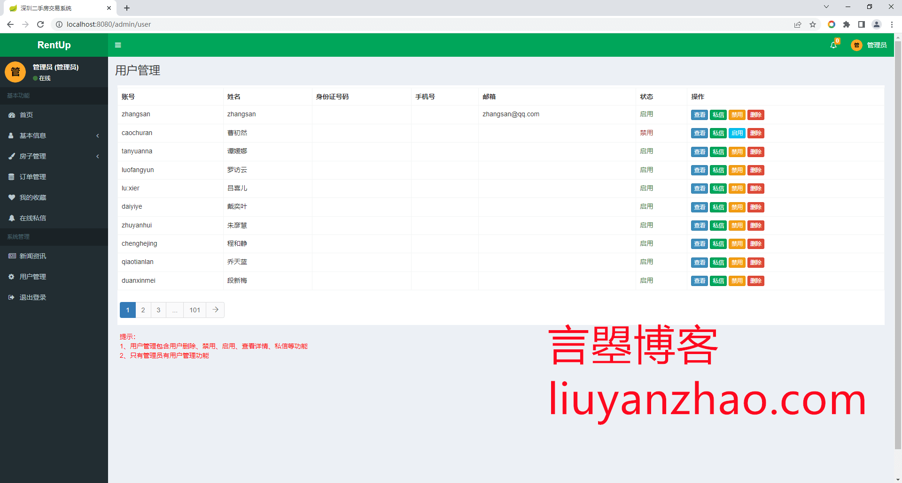
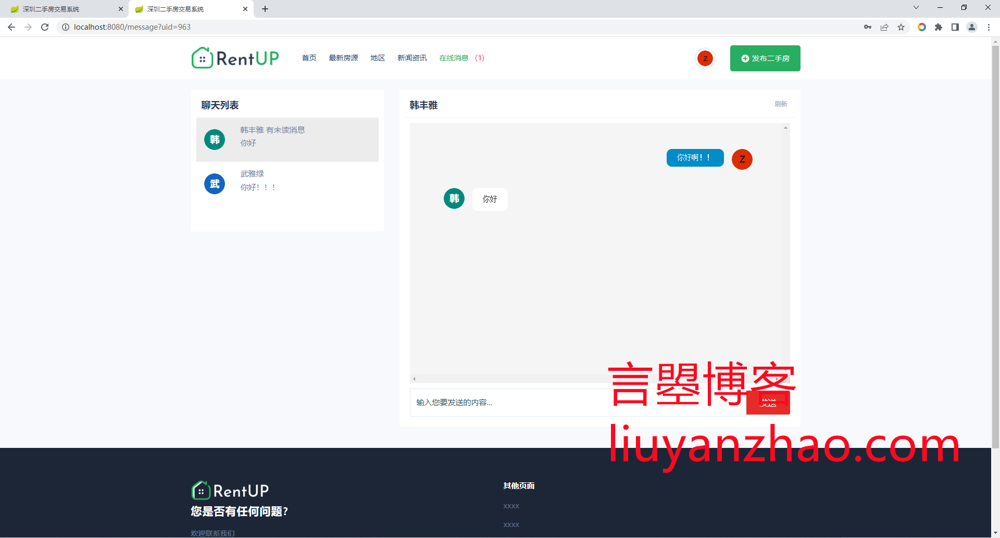

## 博主开发的其他租房或房屋交易项目全部在这里
**[https://liuyanzhao.com/shop.html?k=房屋](https://liuyanzhao.com/shop.html?k=房屋)**  
- -------------------------------------------------------------------------------
- 2022 基于SpringBoot/SSM的最新最轻量级最漂亮的的二手房交易系统 rentup
- 预览地址：[http://rentup.liuyanzhao.com](http://rentup.liuyanzhao.com)
- 详细介绍地址：[https://liuyanzhao.com/shop/rentup.html](https://liuyanzhao.com/shop/rentup.html)
- 代码地址：https://github.com/saysky/rentup-boot 或 https://gitee.com/saysky/rentup-boot
- 完成时间：2022年5月
- 该项目有SpringBoot和SSM2个版本，当前项目是SpringBoot版本，预计下半年会出Vue版本
- 博主的其他房屋交易系统请前往 [https://liuyanzhao.com/shop.html?k=房屋](https://liuyanzhao.com/shop.html?k=房屋)

# 一、功能介绍
- 普通用户
  - 注册、登录、找回密码
  - 发布二手房信息，管理自己的房源信息，上下架
  - 订单管理
  - 收藏管理
  - 在线私信

- 管理员功能
  - 全部房源管理，审核房源
  - 全部订单管理
  - 收藏管理
  - 用户管理
  - 新闻管理
  - 在线私信
  - 个人信息，修改密码

# 二、技术组成
- 1、SpringBoot 或 SSM
- 2、MyBatis
- 3、JSP
- 4、Bootstrap
- 5、MySQL
- 6、Spring Security

# 三、项目截图
1-首页.png

2-首页2.png

3-首页3.png

4-登录.png

5-房源列表.png

6-地区列表.png

7-新闻资讯.png

8-房源详情.png

9-支付页面.png

10-后台首页.png

11-个人信息.png

12-房子管理.png

13-订单管理.png

14-新闻资讯管理.png

15-用户管理.png

16-房源编辑.png

17-用户订单.png

18-收藏管理.png

19-在线私信页面.png

# 四、联系方式
需要完整代码联系博主，微信847064370

